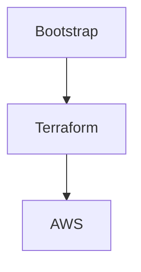

# Documentation Style Guide

**Project:** Cloud Platform Manager (CPM)

**Version:** 1.0

**Status:** Active

---

# Purpose

This document defines the documentation standards used throughout the Cloud Platform Manager (CPM) project.

The goal is to ensure consistency, readability, maintainability, and professional quality across all project documentation.

Every document in this repository should follow the standards defined here.

---

# Documentation Principles

Documentation should be:

- Clear
- Concise
- Accurate
- Consistent
- Version Controlled
- Easy to Navigate
- Easy to Maintain

Documentation is considered part of the product and must be updated whenever functionality changes.

---

# Markdown Standards

## Headings

Use ATX-style headings.

Correct:

```markdown
# Title

## Section

### Sub Section
```

Avoid skipping heading levels.

Incorrect:

```markdown
# Title

### Sub Section
```

---

## Lists

Use unordered lists for collections.

Example:

- AWS
- Terraform
- Python

Use numbered lists for sequential steps.

Example:

1. Bootstrap
2. Deploy
3. Validate

---

## Tables

Use tables for structured information.

Example

| Component | Purpose |
|----------|----------|
| IAM | Identity Management |
| S3 | Object Storage |

---

## Code Blocks

Always specify the language.

Correct

````text
```python
print("Hello CPM")
```

Incorrect

```
print("Hello")
```

---

## File Names

Use lowercase kebab-case.

Examples

```

product-requirements.md
business-problem.md
component-model.md

```

Avoid

```

ProductRequirements.md
Component_Model.md

```

---

# Document Template

Every document should start with the following metadata.

```markdown
# Document Title

| Field | Value |
|------|------|
| Project | Cloud Platform Manager |
| Version | 1.0 |
| Status | Draft |
| Owner | Platform Engineering |
| Last Updated | YYYY-MM-DD |
```

---

# Standard Sections

Unless otherwise required, documentation should follow this structure.

1. Overview
2. Purpose
3. Scope
4. Details
5. References
6. Revision History

---

# Naming Conventions

## Repositories

Format

```

cpm-<component>

```

Examples

```

cpm-bootstrap
cpm-orchestrator
cpm-monitoring
cpm-governance

```

---

## Components

Use PascalCase.

Examples

```

Bootstrap
IAM
Monitoring
Governance

```

---

## APIs

Use REST naming conventions.

Correct

```

GET /accounts
POST /accounts
GET /components
POST /deployments

```

Avoid

```

getAccounts
CreateDeployment

```

---

## Branches

Feature

```

feature/<name>

```

Bug Fix

```

bugfix/<name>

```

Documentation

```

docs/<name>

```

Release

```

release/<version>

```

Examples

```

feature/bootstrap-engine
docs/prd
bugfix/event-processing

```

---

# Commit Messages

Follow Conventional Commits.

Examples

```

feat: add bootstrap workflow

fix: resolve deployment retry issue

docs: update product requirements

refactor: simplify dependency engine

test: add bootstrap unit tests

```

---

# Diagrams

Use Mermaid for architecture and sequence diagrams.

Example

````markdown
