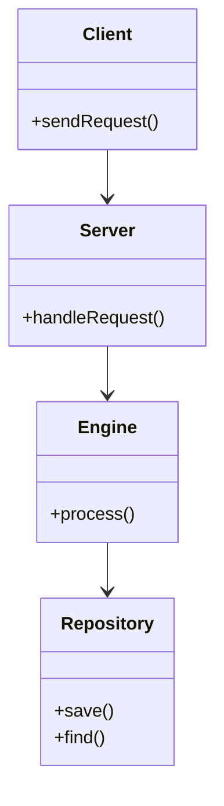

# Component Model

This document describes the primary components of CPM, their interfaces, and how they interact.

## Component Diagram

## Component Details

### Server Component
- **Responsibility**: Listens for incoming connections, deserializes payloads, and manages routes.
- **Interfaces**: REST, gRPC, or CLI commands.

### Engine Component
- **Responsibility**: Orchestrates domain logic, performs computations, and applies validation rules.

### Repository Component
- **Responsibility**: Abstracts database or file system storage details.
