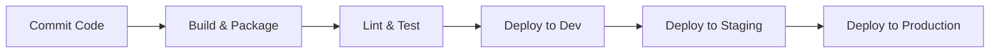

# Deployment Lifecycle

This document describes the deployment strategy, environments, and deployment pipeline lifecycle of the CPM project.

## Deployment Pipeline

## Environments

| Environment | Purpose | Deployment Trigger | Infrastructure |
| ----------- | ------- | ------------------ | -------------- |
| **Dev** | Active testing, continuous integration. | Commit to `main` branch | Kubernetes / Serverless |
| **Staging** | Pre-production testing, UAT. | Release tag created | Kubernetes / Serverless |
| **Prod** | Production live environment. | Manual approval of release | Kubernetes / Serverless |

## Rollback Strategy
In the event of a deployment failure:
1. Automated rollbacks are triggered if health checks fail.
2. Manual rollbacks are initiated via the CI/CD pipeline dashboard.
