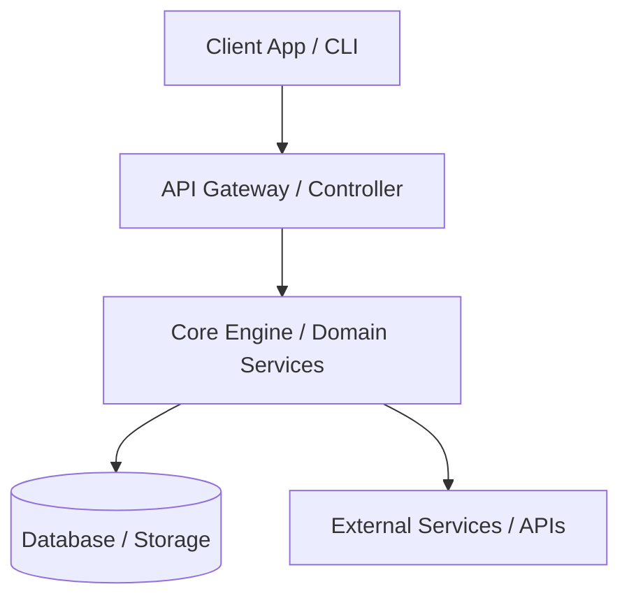

# High-Level Design (HLD)

This document provides a high-level overview of the CPM system architecture, highlighting key modules and their interactions.

## System Overview

## Core Subsystems

### 1. API Gateway / Interface
Handles external incoming requests, routing, rate limiting, and initial validation.

### 2. Core Engine
Implements the main business logic and core rules of the application.

### 3. Data Storage Layer
Manages persistence, caching, and data retrieval policies.

### 4. Integration Layer
Connects the system to external third-party services and APIs.
